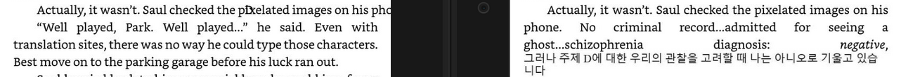

# ePub to azw/kfx "Pre-Converter"

This program generates an `epub` which replaces text that is indecipherable to screen readers (e.g., Braille and Ancient Norse Runes) with images that have alt text (by parsing potential screen-reader-only text).

Additionally, it can be used to convert unsupported characters sets (i.e., Chinese, Japanese, Korean[^1], etc.) into images that can be displayed on Kindles. Example:



## Why does this exist?

Accessibility features are [important](https://kdp.amazon.com/en_US/help/topic/GBPE3QVZ2J3HLQ4B#images) for both blind readers and those who enjoy using Text to Speech (TTS) to listen to their collection. Since `epub` files contain HTML, it is possible to carry over best practices from the web (i.e., [alt text](https://developer.mozilla.org/en-US/docs/Web/API/HTMLImageElement/alt)), to ensure that screen readers can accurately describe images to listeners.

Unfortunately, screen-reader-only text is lost in the conversion process from an `epub` to Kindle's [proprietary format](https://en.wikipedia.org/wiki/Kindle_File_Format). Thus, while the following works for `epub`s, it does not work on Kindles (since neither text will be read aloud).

```html
<style>
	.screen-reader-only {
		display: none;
		height: 0;
		opacity: 0;
		width: 0;
	}
</style>
<span class="runes">ᚦᛖ ᚠᛁᚾᚨᛚ ᚹᚨᚱ</span>
<span class="screen-reader-only">End chapter runic transliteration: The Final War</span>
```

The solution: convert indecipherable text to images with alt text.

```html

```

Unfortunately, going about this process is less than straightforward. Last year, I attempted to convert an `epub` to a Kindle file automatically by uploading it to [Kindle Direct Publishing](https://kdp.amazon.com/) (KDP). Sadly, after a week and countless conversations with customer support, no one could tell me why the conversion process failed[^2]. With no other options, I used [Kindle Create](https://kdp.amazon.com/en_US/help/topic/GUGQ4WDZ92F733GC), to manually recreate the formatting for for a ≈125,000 word (500 pages) novel line-by-line.

Throughout this process, I screenshotted 80+ pieces of indecipherable text, and provided the appropriate alt text using the GUI. As you can imagine, doing this by hand does _not_ scale. Furthermore, in order to maintain the separate Kindle Edition, every edit to the standard `epub` had to be repeated inside of Kindle Create. I am a big fan of automating away suffering, and so that's why this tool exists.

By providing CSS queries of what text to replace (e.g., `.runes`) and what alt text to use (e.g., `.runes+.screen-reader-only`), this program will convert all matching text to images[^3] and update a copy of the desired `epub` with the relevant files. In this way, it is possible to then upload the resulting "pre-converted" file to KDP (or [Send to Kindle](https://www.amazon.com/sendtokindle)), which will then automatically convert it to a Kindle edition with the proper accessibility features.

## Limitations

Sadly, at the time of writing, despite 100M+ downloads on [Android](https://play.google.com/store/apps/details?id=com.amazon.kindle) (and who knows how many on iOS), neither app supports reading alt text aloud[^4]. Hence, this program will only help those reading on official Kindle devices until Amazon brings that feature to the rest of their platforms (at which point files generated via this tool will be "future-proofed").

If you eagerly await that day and would like to see this program sunsetted for being unnecessary, leave a thumbs up or a comment over on [this issue]() (and remember, despite any frustrations that you may have, please be civil).

## Config

Setup a `.env` file in the repo's root directory.

```
SSL_CERT_PATH=/file/path/cert.pem
SLL_KEY_PATH=/file/path/key.pem
```

[^1]: Note, I cannot speak for other East Asian languages, however I can say that Korean characters did actually display correctly on Kindle's Android app. But due to issues with the previewer, I personally converted them to images as a precaution for ensuring compatibility with other platforms.
[^2]: For the curious, this was most likely due to an extraneous subfolder wrapped around the `epub` contents :/
[^3]: Specifically, `jpg`s, (by converting the HTML+CSS to an SVG image and drawing it to a `<canvas>` to make it a compressed raster).
[^4]: Source: my experiments on both platforms, and directly from the mouth of a customer support agent.
